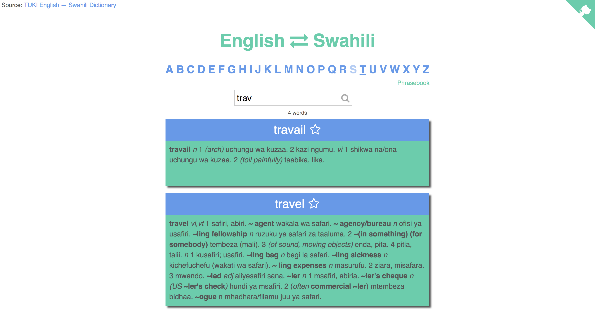

# [Kamusi](https://kamusi.surge.sh) 🇹🇿

English ⇄ Swahili Dictionary and Phrasebook

# Todo
- Search
  - [ ] Search entire dictionary
  - [ ] Improve rendering performance
- Dictionary
  - [ ] Clean up data
  - [ ] Find parsing edge cases e.g. lind.a, -enye